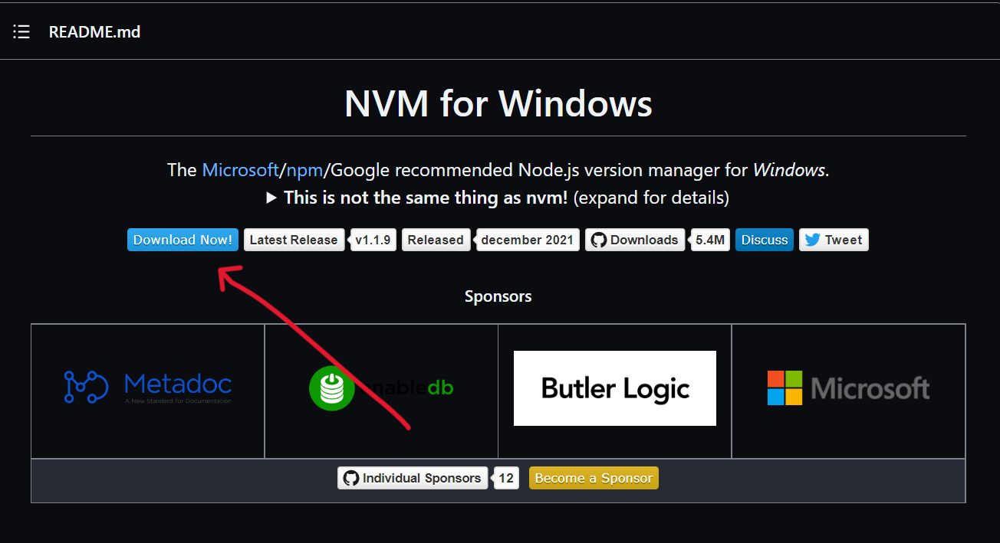
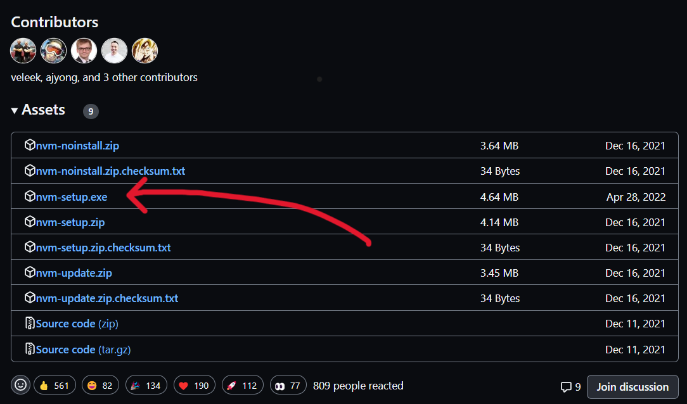

### Uninstall Node.js (if you have it installed outside of nvm)

1. In search on the taskbar, enter Control Panel and select it from the results.

2. Select **Programs** > **Programs and Features.**

3. Press and hold (or right-click) on the program (Node.js) you want to remove and select **Uninstall**. Then follow the directions on the screen.

### Installing NVM

1. Head over to the [nvm-windows repository](https://github.com/coreybutler/nvm-windows#installation--upgrades). Scroll down to the README.md and click on **Download Now !**

2. You now can find the latest version of nvm-windows and download it!

3. Locate the installer on your computer and open it. Follow the installation wizard to install it.

4. Open up PowerShell or Command Prompt and run ` nvm -v ` to confirm the installation.

5. You are good to go!

:::info
To use NVM, you need to open PowerShell or Command Prompt as an admin. You can also use Git bash.
:::

