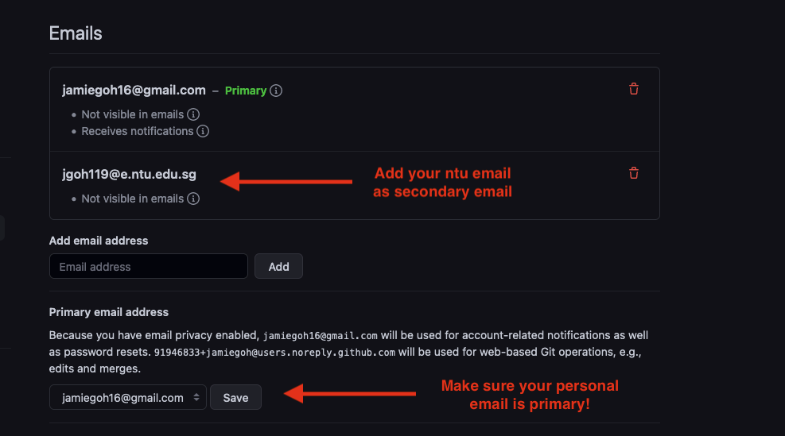
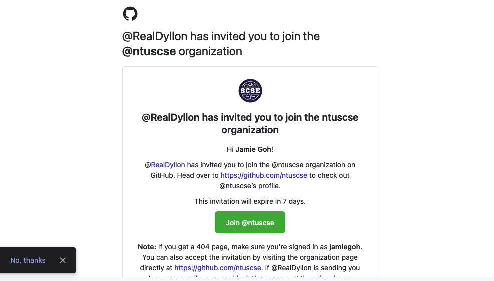
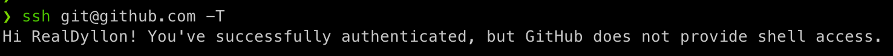

# Github & Git CLI Setup

```mdx-code-block
import Tabs from '@theme/Tabs';
import TabItem from '@theme/TabItem';
```

## Github account

If you don't have an account, sign up [here](https://github.com):

### Add school email as secondary

Once you have an account, add your school email (*@e.ntu.edu.sg) to you
github account as a secondary email



:::caution
Remember to keep your personal email as your primary github email!
:::

### Accept invite to NTU SCSE Github organization and subcommitee team

Check your email for the github organization invite and follow through with enrollment.

The github org allows us to manage internal read/write permission for subcommitee while allowing our
repositories to be publicly readable and open source.




:::info
If you haven't received an email invite, then please ping your IT Executive!
:::

## Git setup

```mdx-code-block
import GitWindows from "./_git-windows.mdx"
import GitMacOS from "./_git-macos.mdx"
import GitLinux from "./_git-linux.mdx"

<Tabs groupId="operating-systems">
    <TabItem value="win" label="Windows">
        <GitWindows/>
    </TabItem>
    <TabItem value="mac" label="macOS">
        <GitMacOS/>
    </TabItem>
    <TabItem value="linux" label="Linux">
        <GitLinux/>
    </TabItem>
</Tabs>
```

### Test your git local install!

Before your SSH connection test, make sure
1. Check for existing SSH keys
2. Generate a new SSH key (if you don't have SSH key)
3. Add a new SSH key to Github account (if you don't have SSH key in github)

Run the following command in your terminal:

```bash
ssh -T git@github.com
```

If you received a response similar to the below image, then you have successfully set up git locally ✅



:::info
Ping in the discord for help if you can't get git to work as expected
:::


