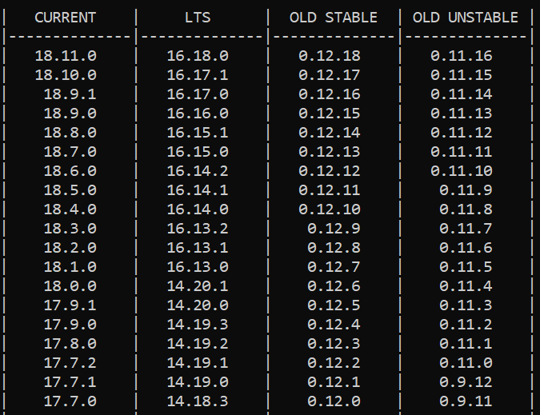

# NVM and Node.js

## How to Install NVM

```mdx-code-block
import OsTabs from "@site/src/components/DocsFeatures/OsTabs.tsx"
import NvmWindows from "./_node-nvm/_node-nvm-windows.mdx"
import NvmMacOS from "./_node-nvm/_node-nvm-macos.mdx"
//import NvmLinux from "./_node-nvm/_node-nvm-linux.mdx"

<OsTabs
    windows={<NvmWindows />}
    macos={<NvmMacOS />}
/>
```
### Install Node using NVM

To install the latest version of Node, run:
```
nvm install latest
```

### Check the list of available versions

Run the following command in your terminal:
```
nvm list available
```

You will see this after running the command above:



You can also install different versions of Node:
```
nvm install node-version-number
nvm install 18.9.1
```

:::info
Once you install a version of Node, the corresponding version of NPM is installed for you. So you don’t need to install NPM separately.
:::

### Check your current version of Node

Run the following command in your terminal:
```
nvm current
```

### Check the list of different versions of Node installed

Run the following command in your terminal:
```
nvm list
```

### Switch between different versions of Node

Run the following command in your terminal:
```
nvm use latest
nvm use 17.7.1
```