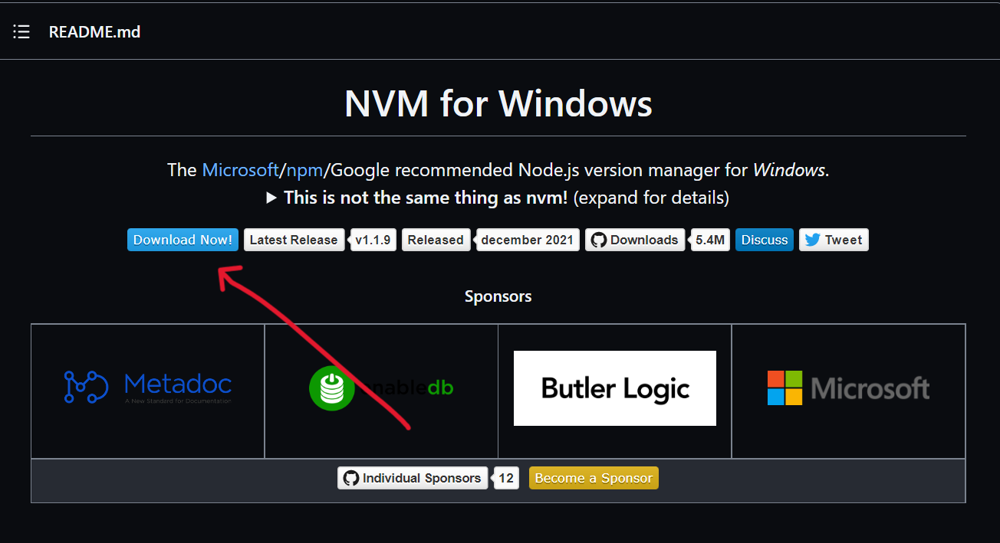

# NVM and Node.js

## How to Install NVM

### Uninstall Node.js(if you have it installed outside of nvm)

1. In search on the taskbar, enter Control Panel and select it from the results.

2. Select **Programs** > **Programs and Features.**

3. Press and hold (or right-click) on the program (Node.js) you want to remove and select **Uninstall**. Then follow the directions on the screen


### Installing the NVM 

1. Head over to the [nvm-windows repository](https://github.com/coreybutler/nvm-windows#installation--upgrades)
    Scroll down to the README.md and click on **Download Now**

    

2. Find the latest version of nvm-windows and download it.


3. Locate the installer on your computer and open it. Follow the installation wizard to install it. 

4. Open up PowerShell or Command Prompt and run `nvm -v` to confirm the installation.

5. You are good to go! 


## How to Use NVM 

:::info
To use NVM, you need to open PowerShell or Command Prompt as an admin. You can also use Git bash.
:::

### Install Node using NVM

To install the latest version of Node, run: 
```
nvm install latest
```

### Check the list of available versions

Run the following command in your terminal:
```
nvm list available
```

You will see this after running the command above: 


You can also install different versions of Node:
```
nvm install node-version-number
nvm install 18.9.1
```

:::info
Once you install a version of Node, the corresponding version of NPM is installed for you. So you don’t need to install NPM separately.
:::

### Check your current version of Node

Run the following command in your terminal:
```
nvm current
```

### Check the list of different versions of Node installed

Run the following command in your terminal:
```
nvm list 
```

### Switch between different versions of Node

Run the following command in your terminal:
```
nvm use latest
nvm use 17.7.1
```
